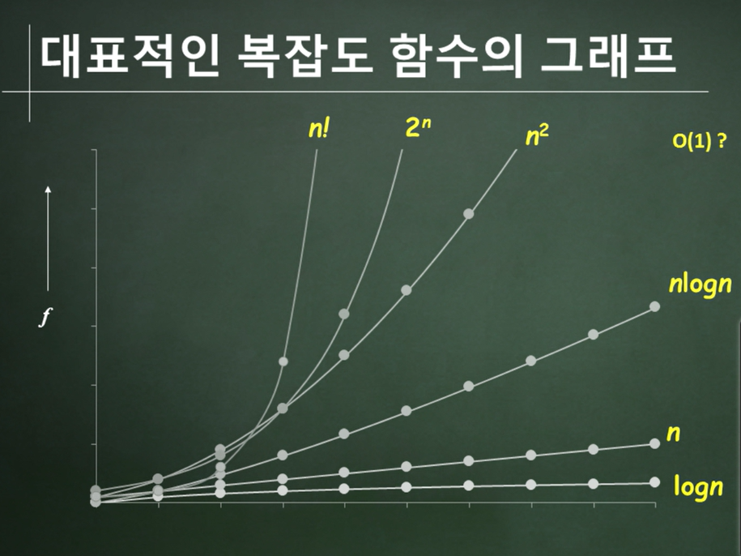

# 자료구조와 알고리즘의 정의 및 표현
## 자료구조란?
### 자료구조의 정의
* 문제 해결을 위해 데이터를 조직하여 표현하는 방법
### 자료구조의 예
* 전화번호부 (ex. 배열, 연결리스트, 트리)
  * 제한 사항 : 이름을 빨리 검색, 새로운 데이터 쌓기 쉽게 추가 등
  * 목적에 따라 유용한 자료구조가 다름
* 수강신청, 연말정산의 대기 줄 -> 큐
* 지하철 노선도 : 역이름, 역 간의 선후 관계 -> 그래프
### 자료구조의 중요성
* 주어진 문제의 특성에 맞는 자료구조를 선택 -> 프로그램의 개발이 쉽고, 성능이 향상

## 추상 데이터 타입
### 추상 데이터 타입
* 자료구조를 기술할 때 사용하는 방법
* 데이터 객체 및 연산의 명세와 데이터 객체의 내부 표현양식/연산의 구현내용을 분리
### ADT에서의 연산의 명세
* 구성 요소 : 함수 이름, 인자들의 타입, 결과들의 타입
* 함수의 호출 방법 및 결과물이 무엇인지를 설명
* 함수의 내부 동작과정 및 구현 방법은 은폐
* information Hiding
### 추상 데이터 타입의 예 - 자연수
* 객체 : 0부터 시작하여 컴퓨터로 표현할 수 있는 최대 정수(INT_MAX)까지의 범위에 속하는 정수들의 집합
* 연산 : Add(x,y) = if ((x+y) <= INT_MAX) return x+y else return INT_MAX
## 알고리즘 이란
### 알고리즘의 정의
* 문제 해결을 위해 특정한 일을 수행하는 명령어들의 집합
### 알고리즘이 만족해야할 조건
* 입력(input) : 0 혹은 그 이상의 입력이 존재
* 출력(Output) : 적어도 하나 이상의 결과물이 출력
* 명확성(Definiteness) : 알고리즘을 구성하는 명령어들의 의미는 명확하여야 하며, 애매모호해서는 안 된다.
* 유한성(Finiteness) : 알고리즘은 한정된 수의 명령어들을 실행한 후 종료하여야 한다.
* 유효성/실행가능성(Effectiveness) : 모든 명령어들은 실행가능해야한다.
## 알고리즘의 표현
### 알고리즘을 표현하는 다양한 방법이 존재
### 예 : 이진 검색
* 오름차순으로 정렬된 정수배열 list[]에서 key가 주어질 때, list[i] = key인 i를 발견하는 문제
### 알고리즘의 표현 방법 1: 자연어
* left =0, right = n-1, middle = (left+right)/2 로 두자.
* list[middle]과 key를 비교하여, 아래 경우들을 처리
  * list[middle] < key : key가 list[middle+1]부터 list[right]에 있으므로, 다시 조사
  * list[middle] = key : middle을 반환
  * list[middle] > key : key가 list[left]부터 list[middle-1]에 있으므로, 다시 조사
### 알고리즘의 표현 방법 2: 유사 코드(pseudo code)
### 알고리즘의 표현 방법 3: 프로그래밍 언어
## 순환 알고리즘
### 순환 알고리즘 (Recursive Algorithm)의 정의
* 자기 자신을 다시 호출하는 알고리즘
* 예: 팩토리얼 계산
```python
def factorial(n):
    if(n<=1):
        return 1
    else:
        return n * factorial(n-1)
```
### 재귀 알고리즘을 작성하는 방법
* 재귀 호출을 종료하는 경계 조건을 설정
* 각 단계마다 경계 조건에 접근하도록 알고리즘의 재귀 호출
# 알고리즘의 복잡도
## 성능 분석
### 프로그램의 평가 기준
* 주어진 문제를 해결
* 정확성
* 문서화
* 모듈화
* 가독성
* 공간 효율성
* 시간 효율성
### 성능 분석 vs 성능 측정
* 성능 분석 : 프로그램을 실행하지 않고 성능을 확인하는 것
* 성능 측정 : 프로그램을 실행하여 성능 확인
### 복잡도의 정의
* 공간 복잡도 : 프로그램 실행에 사용되는 메모리
* 시간 복잡도 : 프로그램 실행에 걸리는 시간
## 시간복잡도 (Time Complexity)
### 실행에 걸리는 시간(Tp) = 컴파일 시간 + 실행 시간
* 컴파일 시간은 고정 & 한번만 필요
* 프로그램 단계 수를 활용하여 시간 복잡도 계산
### 프로그램 단계 수 (Program Step)
* 정의 : 실행 시간이 프로그램의 특성과는 무관한 프로그램의 문법적인 혹은 논리적인 단위
* 프로그램 단계수의 계산
  * 프로그램에 count를 증가시키는 문장을 추가
  * 테이블 방식을 이용
## 점근 표기법
### 동기
* 정확한 프로그램 단계 수를 계산하는 것이 쉽지 않다
* 프로그램 단계 수의 정의 자체가 정확하지 않다.
* 100n + 10과 30n + 30의 비교
### 접근 방법
* Tp(n) = n^2 + 100n 이라고 가정
* n이 충분히 클 경우, 임의의 c3에 대해 Tp(n) > c3n
* 차수가 커질수록 값에 따라 시간이 훨씬 더 오래 걸린다는 개념
## Big-oh(O)
### 정의(Big-Oh): f(n) = O(g(n)) iff
* 시간 복잡도 차원에서 3n +2나 100n + 6이나 동일하게 봄 -> O(n)
* 상수항이나 제일 큰 항을 제외한 나머지 항은 크게 고려되지 않는다
## Omega
## Theta
## 결론
* 시간 복잡도는 최고차항에 따라서 결정이 됨
* 3n^3+3n -> n^3
* 