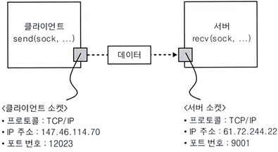

# 1강. 네트워크 어플리케이션의 원리

## 애플리케이션 계층

- 예시 ) 웹 브라우저
- 웹의 대표적인 프로토콜 : HTTP

## 네트워크 애플리케이션

- 운영체제 위에서 실행되는 프로세스인데 다른 머신의 프로세스와 메세지를 주고 받는 것
- OS의 기능으로 다른 머신의 프로세스와 소통하는 것

## 서버-클라이언트 구조

- 네트워크 계층의 가장 대표적인 구조
- 클라이언트 : 필요할 때 만 메세지 주고받음
- 서버 : 언제나 소통 대기 - 고정된 주소를 가져야 함

- 네트워크 관련 기능에 해당하는 API가 소켓 : 소켓으로 소통
- 프로세스가 동작하는 머신을 IP 주소로 지칭함 → 머신 안에 존재하는 수 많은 특정 프로세스는 포트 번호로 지칭함
- 그러면 naver.com은 아이피가 아닌뎅?
    - 도메인을 DNS 프로토콜을 통해서 아이피 주소를 알아옴
    - 그럼 포트 번호은? → HTTP 웹 서버는 80번 포트로 고정해 놓음(Default)

## 프랜스포트 계층

### TCP (신뢰성 ㅇ)

- 유실 없는 전송
- 신뢰성
- 높은 비용
- 클라이언트와 서버 통신 이전에 TCP Connection 필요

### UDP (신뢰성 X)

## HTTP

- Hypertext transfer protocol (하이퍼 텍스트를 전송하는 프로토콜)
- 웹 애플리케이션 계층의 프로토콜
- Request / Response로 이루어짐
- client-server model
- TCP 기반으로 동작
    - 중간에 유실되지 않음 (신뢰성)
    - UDP 보다 비싼 비용
- Stateless(상태 없음) : Request → Response 이후에 아무 동작도 하지 않음 (정적)

### HTTP Connections

- non-persistent HTTP  : TCP 커넥션이 통신 마다 바뀜
    - OS가 TCP 커넥션을 확인하기 위해 통신
- persistent HTTP  : TCP 커넥션 계속 유지
- end-to-end delay using persistent HTTP
    - Control Messages ( TCP handshake, HTTP request) = K bit long
    - Base HTML object = L bits
    - N reference object, each L bit long
    - Link bandwidth = R bps
    - Propagation delay = d seconds

### HTTP request message

- two types of HTTP messages : request, response
- HTTP request message:
    - ASCII(human-readable format)
- 구조
    - request line (GET, POST, HEAD commands)
    - header lines
    - carriage return (헤더 라인 끝을 의미)

### HTTP response message

- 구조
    - status line (프로토콜 상태 코드)
        - 200(ok), 301(Moved Permanetly), 400(Bad Request), 404(Not Found), 505(HTTP Version Not Supported)
    - header lines
    - data : ex) request한 HTML 파일

### User-server state : cookies - keeping “state”

- cookie file에 쿠키가 없을 경우 → 일반적인 requests → 요청 받은 서버에서 클라이언트 번호를 쿠키에 라벨링 → 쿠키와 함께 respones
- 쿠키 번호를 통해 클라이언트 추적 (광고, 추천 알고리즘에 활용)

- 목적 : involving origin 없는 client request 만족
- 장점 : 빠름, 리소스 낭비 없음, 비용 절감
- 단점 : 캐싱된 데이터가 플릿의 서버 사이에서 일관되지 않다는 점

### Web Caches (proxy Server)

- 목적 : involving origin 없는 client request 만족
- 장점 : 빠름, 리소스 낭비 없음, 비용 절감
- 단점 : 캐싱된 데이터가 플릿의 서버 사이에서 일관되지 않다는 점
- 캐시란 데이터를 미리 복사한 임시 저장소
- 보통 자주 호출되는 데이터를 적시에 반환해 줌
- 메모리 캐시의 경우 트래픽 절감, 속도 증가의 장점이 있지만, 원본의 copy를 갖고 있어서 일관성 문제 발생한다.
- 일관성 문제
    - 임시 저장소, 실제 데이터와 맞지 않는 경우가 발생함
    - 해결 방법 : conditional GET
        - 수정된 날짜 우선 비교 (최신화 확인)
            - 수정된 날짜가 같을 경우 (같은 데이터) :Not modified
            - 수정된 날짜가 다를 경우 : 데이터 최신화