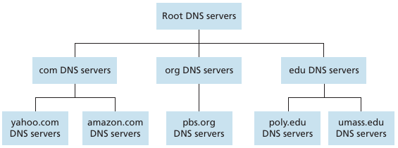

# 2강. DNS: Domain Name System
# DNS

- UDP 기반 통신 :
    - 패킷 손실의 가능성이 있지만 사용하는 이
        - response data의 크기가 작음
        - 빠른 통신 필요 (인터넷 접속 지연 시간을 최소화할 필요성)
- 전화번호부와 같은 개념
- host name과 ip주소를 mapping하는 시스템
- DNS를 한 서버로 구축할 경우 문제점
    - host name이 무제한 적으로 증가
    - 과도한 트래픽
    - 서버가 다운될 경우, 전 세계의 인터넷에 영향 - ***single point*** ***of failure***
- DNS : 분산화, 계층화된 데이터 베이스
    - 
    
    
    
    - root DNS servers
    - TLD DNS server (.com, .org, .kr)
    - authoritative DNS server
        - 네트워크를 가지고 있는 기관(웹 서비스 기관)이 기관의 host name과 ip 주소를 mapping할 책임
    - Local DNS name server
        - 한번 접속한 주소의 host name : ip 주소 데이터를 임시 저장(캐싱)

## DNS : caching, updating records

- DNS records 필드 구성
    - name
    - value
    - type : 타입에 따라 구성이 달라짐
        - A :  name 필드는 hostname, value 필드가 IP 주소
        - NS : name 필드는 domain, value 필드가 authoriative DNS 서버 주소이다. (하위 계층 정보)
        - CNAME : 하나의 도메인 네임을 다른 이름으로 매핑시키는 레코드
        - MX : 메일이 수신될 위치를 결정하는 레코드
    - ttl
- A, NS records 을 통해 하위 계층으로 계속 요청해서 최하위 계층(Target)까지 도달함(A record만 반환)

## DNS name resolution example

특정 웹사이트에 접속할 경우 계층 순으로 DNS server 요청 (ip 주소를 받을 때 까지)

- requesting host → local DNS server
- requesting local DNS server → root DNS server
- requesting local DNS server → TLD DNS server
- requesting local DNS server → authoritative DNS server