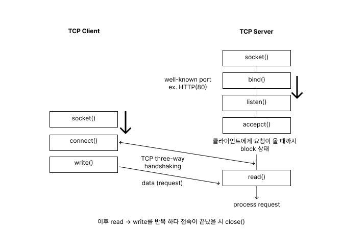

# 소켓 프로그래밍

## 소켓이란

- 프로세스들 간에 통신을 위한 인터페이스
- 우체통(OS) 구멍(소켓)

## 2 가지 종류의 소켓

### 소켓 스트림(TCP)

- 신뢰성
- in-order guaranted
- connection-oriented
- bidirectional

### 소켓 데이타그램(UDP)

- 신뢰성 X
- no order guarantees
- no notion of “connection” - app indicates dest. for each packet
- can send or receive

# Sockets API

- 운영체제가 제공하는 네트워크와 관련된 시스템 콜들의 집합
- Socket API 통신 과
    
    
    

# Socket Creation and Setup

## Function: socket

```c
#ifndef __linux__ 
#include <WinSock2.h> //윈도우 환경일시
#else
#include<sys/types.h> //리눅스 환경일시
#include<sys/socket.h> //리눅스 환경일시
#endif
 
int socket(int domain, int type, int protocol);
```

- domain : 네트워크에 따라 달라진다 TCP/IP 시 AF_INET
- type : TCP or UDP 설정 (SOCK_STREAM, SOCK_DGRAM)
- protocol : 소켓의 프로토콜 타입 지정 보통 0으로 지정하거나 맞는 프로토콜 값으로 지정

## Function: bind

```c
#ifndef __linux__
#include <WinSock2.h> //윈도우 환경일시
#else
#include<sys/types.h> //리눅스 환경일시
#include<sys/socket.h> //리눅스 환경일시
#endif
 
int connect(int sockfd, const struct sockaddr *addr, socklen_t addrlen);
```

- sockfd : socket 함수가 리턴하는 소켓 디스크립터
- sockaddr : 소켓의 주소를 담는 기본 구조체
- myaddr : 접속하고자 하는 아이피 및 서버 포트 정보가 있는 sockaddr 구조체의 주소값
- addrlen : address 구조체의 길이

## Function: listen

```c
int listen(int sockfd, int backlog);
```

- Put socket into passive state ( wait for connections rather than initiate a connection)
- returns 0 (success), -1 (failure)
- sockfd : 소켓 디스크럽터
- backlog: bound on length of unaccepted
- Listen is non-blocking : returns immediately

## Function: accept (서버 대기상태)

```c
int accept(int sockfd, struct sockaddr* cliaddr, int* addrlen);
```

- Accept a new connection
    - Returns file desciptor or -1 (failure)
    - sockfd : 소켓 파일 디스크럽터
    - cliaddr : 클라이언트 ip주소와 포트 번호
    - addrlen : sockaddr 구조체의 길이가 저장된 변수의 주소값
- Accept is blocking
    - returning(클라이언트 호출)전 까지 대기 

## Function: connect

```c
int connect(int sockfd, struct sockaddr* servaddr, int addrlen);
```

- Connect to another socket
    - return 0, -1
    - sockfd : 소켓 파일 디스크럽터
    - servaddr : 서버 ip주소와 포트 번호
    - addrlen : sockaddr 구조체의 길이가 저장된 변수의 주소값
- connect is blocking

## 참고

- [https://prabbit00.tistory.com/53](https://prabbit00.tistory.com/53)